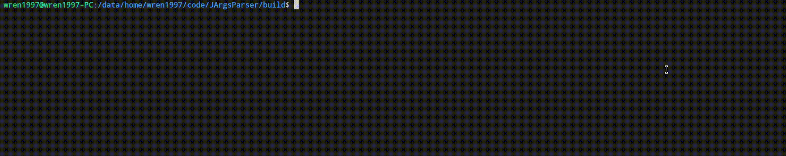

# JArgsParser

`JArgsParser` is a `head-only` arguments parser for `C++11`. You can use it easily by including `interface/jargs_parser_api.hpp` to your project.

`JArgsParser` support multi kinds of arguments:

- position argument: `./JArgsParser a 2 ./src`
- flag argument: `./JArgsParser -d`
- value argument: `./JArgsParser -e 123 -fi 3.14`
- action argument: `./JargsParser -g`

Here's the example:



## QuickStart

Download the latest release and put it into your project.

See also in `src/main.cpp`

Include `JArgsParser`:

```c++
#include "jargs_parser_api.hpp"
using namespace Joger::ArgsParser;
```

Than, we can use `JArgsParser` to require:

| key | type         | value type    | required |
| --- | ------------ | ------------- | -------- |
| a   | position arg | int           | true     |
| b   | position arg | float         | true     |
| c   | position arg | string        | true     |
| d   | flag arg     | bool          | false    |
| e   | value arg    | int           | true     |
| f   | value arg    | float         | false    |
| g   | action arg   | none          | false    |
| i   | value arg    | vec\<float\>  | true     |
| j   | value arg    | vec\<string\> | true     |

```c++
    JArgsParser arg_parser(argc, argv, "Program ABC, for testing JArgsParser", "Here's the place for copyright", "V1.0.0");
    arg_parser.setArgument({"a", ArgsValType::INT, "this is a float position arg"});
    arg_parser.setArgument({"b", ArgsValType::FLOAT, "this is a float position arg"});
    arg_parser.setArgument({"c", ArgsValType::STRING, "this is a STRING position arg"});

    arg_parser.setArgument({"d", "-d", "--di", "this is a flag arg"});

    arg_parser.setArgument({"e", "-e", "--ei", ArgsValType::INT, "this is a value arg"});
    arg_parser.setArgument({"f", "-f", "--fi", ArgsValType::FLOAT, "this is a value arg", false});

    arg_parser.setArgument({"g", "-g", "--g", [](const std::string &key)
                            { printf("action g!\n"); },
                            "this is a ACTION arg"});

    arg_parser.setArgument({"i", "-i", "--iabcdefg", ArgsValType::LIST_FLOAT, "this is a LIST_FLOAT value arg"});

    arg_parser.setArgument({"j", "-j", "--j", ArgsValType::LIST_STRING, "this is a LIST_STRING value arg"});
```

Than we `parseArgs` and get them.(MACRO `GET_ARGS*` is defined in `src/main.cpp`)

```c++
    if (false == arg_parser.parseArgs())
    {
        printf("parse failed\n");
        return -1;
    }
    GET_ARGS("a", int, "%d");
    GET_ARGS("a", long, "%d");
    GET_ARGS("a", unsigned int, "%d");
    GET_ARGS("a", unsigned long, "%d");
    GET_ARGS("b", int, "%d");
    GET_ARGS("b", float, "%f");
    GET_ARGS("b", double, "%f");
    GET_ARGS_STR("c", std::string, "%s");
    GET_ARGS("d", bool, "%d");
    GET_ARGS("e", int, "%d");
    GET_ARGS("f", float, "%f");

    GET_ARGS_VEC("i", float, "%f");
    GET_ARGS_VEC("i", double, "%f");

    GET_ARGS_VEC_STR("j", std::string, "%s");
```

## TODO

- [ ] UT
- [ ] DOCS
