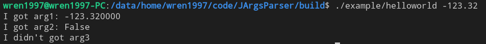
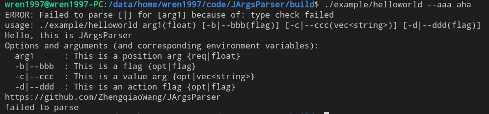
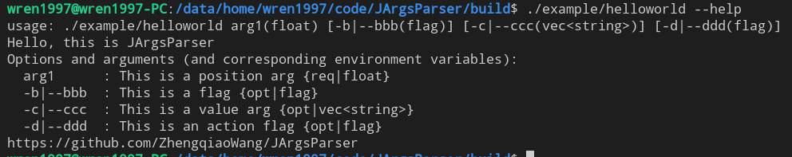

# JArgsParser

[[中文]](README_zhCN.md)

`JArgsParser` is a `head-only` arguments parser for `C++11`. You can use it easily by including `interface/jargs_parser_api.hpp` to your project.

`JArgsParser` support multi kinds of arguments:

- position argument: `./JArgsParser a 2 ./src`
- flag argument: `./JArgsParser -d`
- value argument: `./JArgsParser -e 123 -fi 3.14`
- action argument: `./JargsParser -g`

Here's the example:

**position args**



**type check**



**default help**


**default version**


**call help**



**array input**


## QuickStart

Download the latest release and put it into your project.

See also in `example/helloworld.cpp`

Include `JArgsParser`:

```c++
#include "jargs_parser_api.hpp"
using namespace Joger::ArgsParser;
```

Than, we can use `JArgsParser` to require:

| key | type         | value type    | required |
| --- | ------------ | ------------- | -------- |
| arg1   | position arg | int           | true     |
| arg2   | flag arg | bool         | false     |
| arg3   | value arg | vec\<string\>        | false     |
| arg4   | action arg     | action          | false    |

```c++
JArgsParser arg_parser(argc, argv, "Hello, this is JArgsParser", "https://github.com/ZhengqiaoWang/JArgsParser", "V0.0.2");
arg_parser.setArgument({"arg1", ArgsValType::FLOAT, "This is a position arg"});
arg_parser.setArgument({"arg2", "-b", "--bbb", "This is a flag"});
arg_parser.setArgument({"arg3", "-c", "--ccc", ArgsValType::LIST_STRING, "This is a value arg", false});
arg_parser.setArgument({"arg4", "-d", "--ddd", []()
                        { printf("** yoho! You call the ddd! **\n"); },
                        "This is an action flag"});
```

Than we `parseArgs` and get them.

```c++
if (false == arg_parser.parseArgs())
{
    printf("failed to parse\n");
    return -1;
}

{
    // arg 1
    double var_arg1{0};
    if (false == arg_parser.getArgument("arg1", var_arg1))
    {
        printf("failed to get arg\n");
        return -1;
    }
    printf("I got arg1: %f\n", var_arg1);
}

{
    // arg 2
    bool var_arg2{false};
    if (false == arg_parser.getArgument("arg2", var_arg2))
    {
        printf("I didn't got arg2\n");
    }
    printf("I got arg2: %s\n", var_arg2 ? "True" : "False");
}

{
    // arg 3
    std::vector<std::string> var_arg3;
    if (false == arg_parser.getArgument("arg3", var_arg3))
    {
        printf("I didn't got arg3\n");
    }
    else
    {
        printf("I got arg3: ");
        for (auto &arg : var_arg3)
        {
            printf("%s ",arg.c_str());
        }
        printf("\n");
    }
}
```

Congratulations! Now you can use `JArgsParser`!

## Want an advance support?

Sorry, document is now ready now. If you want to get more information, please go to see `example/show_all.cpp` or `ut/main.cpp`.

Or, may be you can join us.

## Stargazers

[](https://github.com/ZhengqiaoWang/JArgsParser/stargazers)

## Forkers

[](https://github.com/ZhengqiaoWang/JArgsParser/network/members)

## TODO

- [x] UT 20221015
- [ ] DOCS
