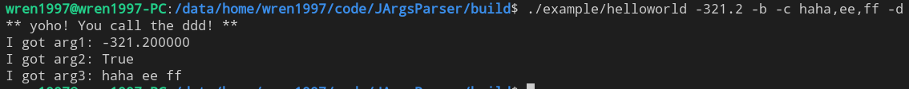

# JArgsParser

`JArgsParser`是一个只有一个头文件的C++11参数解析库。我们可以将头文件引入便可快速地使用。

目前它支持4种类型的参数：

- 位置参数: `./JArgsParser a 2 ./src`
- 标志参数: `./JArgsParser -d`
- 值参数: `./JArgsParser -e 123 -fi 3.14`
- 动作参数: `./JargsParser -g`，与程序内定义的函数绑定，当用于填写动作参数时会优先触发函数

与此同时，还带有默认的标志参数：

- `-h|--help`: 帮助
- `-v|--version`: 版本

下面是效果示例：

**位置参数**


**参数类型检查**


**默认帮助**


**默认版本**


**用户触发帮助**


**支持数组输入**




## 如何开始

下载最新的发布版本（interface/jargs_parser_api.hpp）然后放到你的项目目录里。我们可以参考`example/helloworld.cpp`来学习使用这个库。

在项目代码中`include`一下`JArgsParser`:

```c++
#include "jargs_parser_api.hpp"
using namespace Joger::ArgsParser;
```

然后我们手动设置一下都要收到什么参数：

| key | type         | value type    | required |
| --- | ------------ | ------------- | -------- |
| arg1   | position arg | int           | true     |
| arg2   | flag arg | bool         | false     |
| arg3   | value arg | vec\<string\>        | false     |
| arg4   | action arg     | action          | false    |

```c++
JArgsParser arg_parser(argc, argv, "Hello, this is JArgsParser", "https://github.com/ZhengqiaoWang/JArgsParser", "V0.0.2");
arg_parser.setArgument({"arg1", ArgsValType::FLOAT, "This is a position arg"});
arg_parser.setArgument({"arg2", "-b", "--bbb", "This is a flag"});
arg_parser.setArgument({"arg3", "-c", "--ccc", ArgsValType::LIST_STRING, "This is a value arg", false});
arg_parser.setArgument({"arg4", "-d", "--ddd", []()
                        { printf("** yoho! You call the ddd! **\n"); },
                        "This is an action flag"});
```

然后我们就可以解析出结果：

```c++
if (false == arg_parser.parseArgs())
{
    printf("failed to parse\n");
    return -1;
}

{
    // arg 1
    double var_arg1{0};
    if (false == arg_parser.getArgument("arg1", var_arg1))
    {
        printf("failed to get arg\n");
        return -1;
    }
    printf("I got arg1: %f\n", var_arg1);
}

{
    // arg 2
    bool var_arg2{false};
    if (false == arg_parser.getArgument("arg2", var_arg2))
    {
        printf("I didn't got arg2\n");
    }
    printf("I got arg2: %s\n", var_arg2 ? "True" : "False");
}

{
    // arg 3
    std::vector<std::string> var_arg3;
    if (false == arg_parser.getArgument("arg3", var_arg3))
    {
        printf("I didn't got arg3\n");
    }
    else
    {
        printf("I got arg3: ");
        for (auto &arg : var_arg3)
        {
            printf("%s ",arg.c_str());
        }
        printf("\n");
    }
}
```

恭喜，你现在可以使用 `JArgsParser` 了!

## 使用进阶

可以访问[中文用户手册](doc/user_guide_zhCN.md)获取更多用法～

## 是谁~给我了Star~

[](https://github.com/ZhengqiaoWang/JArgsParser/stargazers)

## 是谁~又点了Fork~

[](https://github.com/ZhengqiaoWang/JArgsParser/network/members)